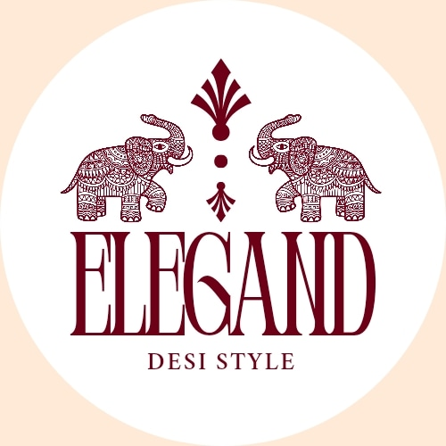

[](https://elegand-desi-fashion.vercel.app/)

# ELEGAND - Desi Style Fashion E-commerce

**ELEGAND** is a premium e-commerce platform celebrating traditional Desi fashion with modern elegance. Built with **Next.js 14**, **TypeScript**, **Tailwind CSS**, **Redux Toolkit**, **Framer Motion**, and **ShadCN UI**, this application showcases exquisite Desi fashion including sarees, lehengas, kurtis, and traditional accessories.

## Table of Contents

- [Overview](#overview)
- [Features](#features)
- [Technologies](#technologies)
- [Installation](#installation)
- [Usage](#usage)
- [Project Structure](#project-structure)
- [Styling & UI Components](#styling--ui-components)
- [State Management](#state-management)
- [Deployment](#deployment)
- [Contributing](#contributing)
- [License](#license)

## Overview

ELEGAND is a comprehensive Desi fashion e-commerce solution that demonstrates modern web development practices combined with cultural elegance. The project showcases:

- **Heritage Celebration**: Curated collection of traditional Desi fashion
- **Modern Architecture**: Next.js 14 App Router with TypeScript for type safety
- **Elegant Design**: Sophisticated color palette (Maroon #6c0017 & Peach #ffead7)
- **State Management**: Redux Toolkit for managing shopping cart and application state
- **Performance**: Optimized for Core Web Vitals and user experience
- **Responsive Design**: Mobile-first approach with Tailwind CSS

## Features

### Core Features
- ✅ **Desi Fashion Catalog**: Browse sarees, lehengas, kurtis, and accessories
- ✅ **Shopping Cart**: Add, remove, and manage cart items with Redux
- ✅ **Product Details**: Detailed product pages with image galleries
- ✅ **Responsive Design**: Optimized for all device sizes
- ✅ **Search & Filter**: Advanced product filtering by category and style
- ✅ **Customer Reviews**: Product rating and testimonial system
- ✅ **Newsletter Subscription**: Stay updated with exclusive offers

### Technical Features
- ✅ **Server-Side Rendering (SSR)**: Fast page loads and SEO optimization
- ✅ **Static Site Generation (SSG)**: Pre-rendered pages for better performance
- ✅ **TypeScript**: Full type safety across the application
- ✅ **Redux Toolkit**: Modern state management
- ✅ **Framer Motion**: Smooth animations and micro-interactions
- ✅ **ShadCN UI**: Accessible and customizable component library
- ✅ **Hot Module Replacement**: Fast development workflow
- ✅ **Code Splitting**: Optimized bundle sizes

## Technologies

| Category | Technology | Version | Purpose |
|----------|------------|---------|---------|
| **Framework** | Next.js | 14.2.30 | React framework with SSR/SSG |
| **Language** | TypeScript | 5.x | Type-safe JavaScript |
| **Styling** | Tailwind CSS | 3.4.1 | Utility-first CSS framework |
| **State Management** | Redux Toolkit | 2.2.7 | Predictable state container |
| **UI Library** | ShadCN UI | Latest | Accessible component library |
| **Animations** | Framer Motion | 11.5.4 | Motion library for React |
| **Icons** | Lucide React | 0.438.0 | Beautiful icon library |

## Installation

### Prerequisites
- Node.js 18.17 or later
- npm, yarn, or pnpm package manager
- Git

### Step-by-Step Installation

1. **Clone the repository:**
   ```bash
   git clone https://github.com/yourusername/elegand-desi-fashion.git
   cd elegand-desi-fashion
   ```

2. **Install dependencies:**
   ```bash
   # Using npm
   npm install

   # Using yarn
   yarn install

   # Using pnpm
   pnpm install
   ```

3. **Run the development server:**
   ```bash
   # Using npm
   npm run dev

   # Using yarn
   yarn dev

   # Using pnpm
   pnpm dev
   ```

4. **Open your browser:**
   Navigate to [http://localhost:3000](http://localhost:3000)

## Usage

### Development Commands

```bash
# Start development server
npm run dev

# Build for production
npm run build

# Start production server
npm run start

# Run linting
npm run lint
```

### Environment Setup

Create a `.env.local` file in the root directory:

```env
# Add your environment variables here
NEXT_PUBLIC_API_URL=your_api_url
NEXT_PUBLIC_SITE_URL=http://localhost:3000
```

## Project Structure

```
ELEGAND/
├── public/                     # Static assets
│   ├── icons/                 # SVG icons
│   ├── images/                # Product images
│   └── logo-elegand.png       # Brand logo
├── src/
│   ├── app/                   # Next.js App Router
│   │   ├── layout.tsx         # Root layout with providers
│   │   ├── page.tsx           # Homepage
│   │   ├── cart/              # Shopping cart pages
│   │   └── shop/              # Product catalog
│   ├── components/
│   │   ├── ui/               # ShadCN UI components
│   │   ├── common/           # Shared components
│   │   ├── layout/           # Layout components
│   │   │   ├── Navbar/       # Navigation
│   │   │   └── Footer/       # Footer
│   │   ├── homepage/         # Homepage sections
│   │   ├── product-page/     # Product detail components
│   │   ├── cart-page/        # Cart components
│   │   └── shop-page/        # Shop filtering components
│   ├── lib/
│   │   ├── features/         # Redux slices
│   │   ├── hooks/            # Custom React hooks
│   │   ├── store.ts          # Redux store configuration
│   │   └── utils.ts          # Utility functions
│   ├── styles/
│   │   ├── globals.css       # Global styles with Desi color palette
│   │   └── fonts/            # Custom font files
│   └── types/                # TypeScript type definitions
├── components.json            # ShadCN UI configuration
├── next.config.mjs           # Next.js configuration
├── tailwind.config.ts        # Tailwind CSS configuration
├── tsconfig.json             # TypeScript configuration
└── package.json              # Dependencies and scripts
```

## Styling & UI Components

### Color Palette (Desi Elegance)
- **Primary**: Maroon (#6c0017) - Represents tradition and elegance
- **Secondary**: Peach (#ffead7) - Represents warmth and sophistication
- **Background**: White with subtle peach accents

### Tailwind CSS Configuration
- Custom color palette inspired by Desi aesthetics
- Responsive breakpoints for mobile-first design
- Typography scale for elegant readability
- Animation utilities for smooth interactions

### ShadCN UI Components
- Accessible by default
- Customizable themes aligned with Desi colors
- TypeScript support
- Radix UI primitives

## State Management

### Redux Toolkit Setup
- Cart state management for shopping functionality
- Product selection state (colors, sizes)
- Persistent state across sessions

### Cart Management
- Add/remove products
- Update quantities
- Calculate totals
- Persist across sessions with Redux Persist

## Deployment

### Vercel Deployment (Recommended)
1. Connect your GitHub repository to Vercel
2. Configure environment variables
3. Deploy automatically on push

### Manual Deployment
```bash
# Build the application
npm run build

# Start production server
npm run start
```

### Docker Deployment
```dockerfile
FROM node:18-alpine
WORKDIR /app
COPY package*.json ./
RUN npm ci --only=production
COPY . .
RUN npm run build
EXPOSE 3000
CMD ["npm", "start"]
```

## Contributing

We welcome contributions! Please follow these guidelines:

### Getting Started
1. Fork the repository
2. Create a feature branch: `git checkout -b feature/amazing-feature`
3. Make your changes
4. Add tests if applicable
5. Commit your changes: `git commit -m 'Add amazing feature'`
6. Push to the branch: `git push origin feature/amazing-feature`
7. Open a Pull Request

### Code Standards
- Use TypeScript for all new code
- Follow the existing code style
- Add JSDoc comments for functions
- Update tests and documentation

## License

This project is licensed under the MIT License - see the LICENSE file for details.

## Contact

For inquiries about ELEGAND, please reach out to our team. We celebrate the beauty of Desi fashion and welcome your feedback.

---

**ELEGAND** - *Celebrating Desi Style with Modern Elegance* ✨
